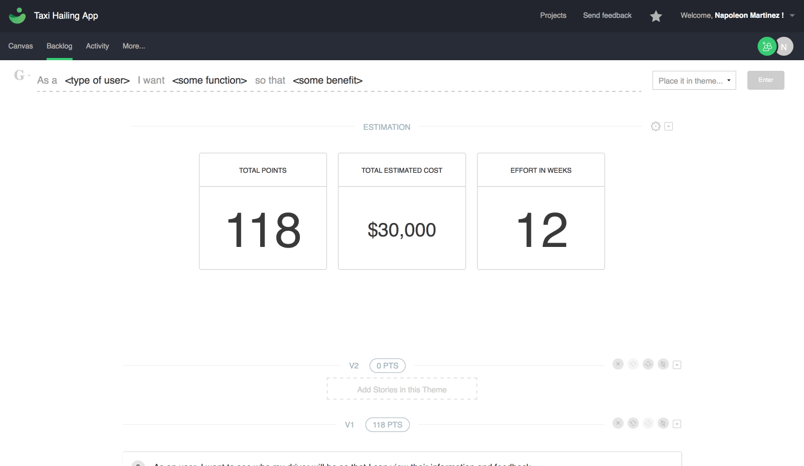

About Arbor
=====================
One of our internal tools is Arbor, a hybrid software and consulting service that allows startup entrepreneurs to distill ideas into an actionable roadmap that your team can use to build out your product. 

The first step, the backbone of Arbor, is user stories. 
As a <Who> I want <What> so that <Why>
  

  
Keeping the Typewriter simple
=====================
When improving the Typewriter tool, our guiding principle was to stay true to the simplicity and efficiency that the Arbor community has grown to expect. To that end, we dug through the feedback and arrived at two features that felt just expected.

The first is simple, we fixed the typewriter to the top of the page so that it follows you as you explore your backlog. No more scrolling back and forth as you build out themes. The second is that we added a freeform story ribbon to the backlog. Now you have the flexibility to write stories in whatever form you choose.

Initial configurations
=====================
- Add a .env file with any necessary ENVIRONMENT variable you may need
- Use config/database.yml.example to create config/database.yml

Environment Variables needed
============================
MAXIMUM_MEMBER_COUNT= int

POOL_SIZE= int

FROM_EMAIL_ADDRESS= String

TRELLO_DEVELOPER_PUBLIC_KEY= String

LOG_ENTRIES_PER_PAGE= int

SIDEBAR_VERSION= String

META_TITLE= String

META_DESCRIPTION= String

AMAZON_KEY= String

AMAZON_SECRET= String

AMAZON_BUCKET_NAME= String

TEST_ENV_NUMBER= int

GOOGLE_ANALYTICS_KEY= String

USE_GOOGLE_ANALYTICS= boolean

INTERCOM_APP_ID= String

MOUSEFLOW_SRC= String

